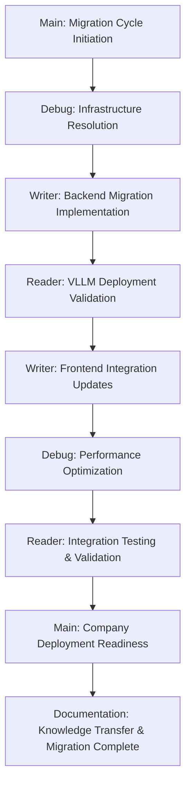

# Ollama-to-VLLM Migration Cycle - Strategic Framework

**Created**: 2025-08-27  
**Thread Origin**: Documentation Thread - Migration Cycle Preparation  
**Purpose**: Complete strategic framework for eliminating Ollama dependencies and achieving GPU-accelerated performance

## 🎯 **Migration Cycle Overview**

### **Primary Mission Statement**
```yaml
Cycle_Objective: "Complete elimination of Ollama dependencies with full VLLM migration enabling GPU-accelerated AI inference for company deployment readiness"

Success_Definition:
  - Zero Ollama references in production codebase
  - RTX 5070 Ti actively utilized with >50% GPU utilization during inference
  - Interactive response times <10 seconds for company deployment standards
  - Advanced model deployment with 7B+ parameter support and GPU acceleration
  - Professional-grade reliability and concurrent user support capabilities
```

### **Critical Performance Gap Resolution**
```yaml
Current_System_Limitations:
  Hardware_Investment: RTX 5070 Ti 16GB VRAM completely unused (0% utilization)
  Response_Performance: 18-38s queries vs <10s interactive requirements
  Processing_Method: CPU-only Ollama vs GPU-accelerated VLLM potential
  Company_Deployment_Blocker: Response times exceed professional usability standards
  
Target_Performance_Achievement:
  GPU_Acceleration: >50% RTX 5070 Ti utilization during AI operations
  Response_Times: <10s complex queries, <5s simple questions
  Model_Capabilities: 7B+ parameter deployment with full GPU memory utilization
  Concurrent_Support: 3-5 simultaneous users without performance degradation
  Interactive_Quality: Professional AI assistant experience for company use
```

## 🧵 **Multi-Thread Migration Strategy**

### **Thread Coordination Framework**
```yaml
Thread_Responsibilities:
  🎯_Main_Thread:
    Role: "Migration Orchestration & Validation Authority"
    Primary_Focus: "Coordinate systematic Ollama elimination and ensure zero-dependency achievement"
    Key_Deliverables:
      - Overall migration timeline coordination and milestone tracking
      - Integration testing between thread deliverables and performance validation
      - Company deployment readiness criteria validation and sign-off
      - Success metrics verification and final migration completion authority
    
  🔍_Reader_Thread:
    Role: "VLLM Technical Validation & Performance Analysis"
    Primary_Focus: "Validate VLLM deployment functionality and GPU acceleration achievement"
    Key_Deliverables:
      - VLLM container deployment validation with GPU passthrough functionality
      - Advanced model loading testing and GPU memory allocation verification
      - API endpoint compatibility validation and response format compliance
      - Performance benchmarking and concurrent user capacity testing
    
  ⚡_Writer_Thread:
    Role: "Complete Codebase Migration Implementation"
    Primary_Focus: "Replace all Ollama dependencies with VLLM-compatible implementations"
    Key_Deliverables:
      - Backend service migration (chat_service.py, ai_service.py) to VLLM APIs
      - Frontend client updates (deepseekService.ts) for new service integration
      - Configuration management updates for VLLM service discovery and endpoints
      - Container infrastructure deployment with GPU access and model management
    
  🔧_Debug_Thread:
    Role: "Infrastructure Resolution & Performance Optimization"
    Primary_Focus: "Resolve technical blockers preventing VLLM deployment and GPU utilization"
    Key_Deliverables:
      - Docker NVIDIA runtime configuration for GPU container access
      - Container registry authentication resolution for VLLM image deployment
      - API compatibility debugging between frontend and VLLM backend services
      - Model loading optimization and GPU memory management configuration
    
  📚_Documentation_Thread:
    Role: "Migration Documentation & Knowledge Integration"
    Primary_Focus: "Document migration procedures and transfer knowledge to persistent agents"
    Key_Deliverables:
      - Comprehensive VLLM deployment guides and configuration documentation
      - API migration procedures and compatibility troubleshooting guides
      - Agent knowledge updates with GPU acceleration and performance optimization expertise
      - Company deployment documentation and user training material preparation
```

### **Sequential Workflow Design for Migration**


## 📋 **Phase-Based Implementation Strategy**

### **Phase 1: Infrastructure Foundation (Week 1)**

#### **🔧 Debug Thread Priority - Container Infrastructure Resolution**
```yaml
Docker_GPU_Configuration:
  Tasks:
    - Install and configure nvidia-container-runtime package
    - Update /etc/docker/daemon.json with GPU runtime configuration
    - Test GPU device access in containers with nvidia-smi validation
    - Configure docker-compose GPU device passthrough for VLLM services
  
  Success_Criteria:
    - Docker containers can access RTX 5070 Ti with proper device passthrough
    - nvidia-smi functional within VLLM container environment
    - GPU memory allocation and CUDA runtime accessible from containerized services
    - Container restart and GPU access reliability verified

Container_Registry_Resolution:
  Tasks:
    - Resolve ghcr.io/vllm-project authentication issues
    - Configure proper credentials for VLLM container image access
    - Test VLLM image pull and deployment procedures
    - Implement fallback registry options or local container building
  
  Success_Criteria:
    - VLLM container images successfully pulled from registry
    - Container deployment functional with proper image versions
    - Authentication credentials properly configured and persistent
    - Alternative deployment methods available if registry issues persist
```

#### **⚡ Writer Thread Support - Service Abstraction Preparation**
```yaml
API_Abstraction_Layer_Creation:
  Tasks:
    - Design unified AI service interface supporting both Ollama and VLLM APIs
    - Implement environment-based service switching for gradual migration
    - Create request/response translation layer for API compatibility
    - Develop configuration management for dual-service operation during transition
  
  Initial_Backend_Assessment:
    - Audit all Ollama API calls in backend services (chat_service.py, ai_service.py)
    - Document request/response format differences between Ollama and VLLM
    - Plan gradual migration strategy with backward compatibility
    - Prepare service discovery updates for VLLM endpoint configuration
```

### **Phase 2: VLLM Deployment & Validation (Week 2)**

#### **🔍 Reader Thread Priority - VLLM Service Validation**
```yaml
VLLM_Container_Deployment:
  Tasks:
    - Deploy VLLM container with resolved GPU passthrough configuration
    - Load 7B+ parameter HuggingFace model with GPU memory allocation
    - Validate VLLM API endpoints and response format compatibility
    - Test model inference performance and GPU utilization measurement
  
  Validation_Procedures:
    - Confirm >50% GPU utilization during model inference operations
    - Measure response times for various query complexities and sizes
    - Test concurrent query handling and GPU memory management
    - Validate API endpoint availability and proper response format

Model_Performance_Analysis:
  Tasks:
    - Benchmark inference speed comparison between CPU (Ollama) and GPU (VLLM)
    - Test multiple model sizes and parameter counts for optimal performance
    - Analyze GPU memory usage and thermal management during sustained operation
    - Document performance characteristics for different query types and complexities
  
  Performance_Targets:
    - Simple queries: <5 seconds response time with GPU acceleration
    - Complex analysis: <10 seconds for technical problem-solving
    - Concurrent users: 3-5 simultaneous queries without performance degradation
    - GPU utilization: >50% during active inference with efficient memory management
```

#### **⚡ Writer Thread Coordination - Backend Migration Implementation**
```yaml
Backend_Service_Migration:
  Tasks:
    - Replace Ollama client calls in chat_service.py with VLLM-compatible implementation
    - Update ai_service.py for VLLM API format and response handling
    - Modify configuration management (config.py) for VLLM service discovery
    - Implement gradual migration with feature flags and fallback mechanisms
  
  API_Compatibility_Implementation:
    - Update request format translation for VLLM API compatibility
    - Modify response parsing and error handling for VLLM-specific format
    - Implement service health checks and availability monitoring
    - Test end-to-end API communication between backend and VLLM service

Environment_Configuration_Updates:
  Tasks:
    - Replace OLLAMA_* environment variables with VLLM_* equivalents
    - Update service discovery configuration for VLLM endpoints
    - Modify container configuration for VLLM service integration
    - Test configuration management and service startup procedures
```

### **Phase 3: Frontend Integration & Complete Migration (Week 3)**

#### **⚡ Writer Thread Priority - Frontend Client Migration**
```yaml
Frontend_API_Client_Updates:
  Tasks:
    - Update deepseekService.ts for VLLM API endpoint format compatibility
    - Modify frontend API clients for new request/response structure
    - Implement VLLM-specific error handling and retry logic
    - Update service discovery and endpoint configuration in frontend
  
  User_Interface_Integration:
    - Test Vue 3 chat interface compatibility with VLLM backend
    - Validate real-time message streaming and response handling
    - Implement performance monitoring display for GPU utilization
    - Update user interface elements for VLLM-specific features

Complete_Dependency_Elimination:
  Tasks:
    - Systematically remove all remaining Ollama references from codebase
    - Update configuration files and environment variable definitions
    - Remove Ollama container and service definitions
    - Clean up documentation and comments referencing Ollama services
  
  Validation_Procedures:
    - Execute comprehensive grep audit for any remaining Ollama references
    - Test complete system functionality without Ollama dependencies
    - Validate all services operational with VLLM-only configuration
    - Confirm zero Ollama references across entire project codebase
```

#### **🔧 Debug Thread Support - Performance Optimization**
```yaml
GPU_Memory_Management_Optimization:
  Tasks:
    - Optimize VLLM model loading for efficient GPU memory utilization
    - Configure GPU memory allocation and caching for sustained performance
    - Implement GPU thermal monitoring and performance throttling prevention
    - Test GPU memory management under various load scenarios

API_Performance_Debugging:
  Tasks:
    - Profile API request/response performance between frontend and VLLM
    - Optimize network communication and reduce latency overhead
    - Debug any performance bottlenecks in service communication
    - Implement performance monitoring and alerting for degradation detection
```

### **Phase 4: Integration Testing & Deployment Readiness (Week 4)**

#### **🎯 Main Thread Coordination - Complete System Validation**
```yaml
Integration_Testing_Comprehensive:
  Tasks:
    - Coordinate end-to-end system testing with all components integrated
    - Validate complete chat interface functionality with VLLM backend
    - Test RAG system integration with VLLM and project context database
    - Verify all services operational and communicating properly
  
  Company_Deployment_Readiness_Validation:
    - Test interactive response times meet <10s professional standards
    - Validate concurrent user support with 3-5 simultaneous queries
    - Confirm system reliability and error handling under load
    - Test complete user workflow from interface to AI response delivery

Migration_Completion_Verification:
  Tasks:
    - Execute automated Ollama dependency elimination validation script
    - Confirm GPU utilization monitoring shows >50% during inference
    - Validate response time targets achieved across all query types
    - Test advanced model deployment functionality and performance
  
  Success_Criteria_Sign_Off:
    - Zero Ollama references confirmed in production codebase
    - GPU acceleration confirmed with measurable utilization improvement
    - Interactive performance targets met for company deployment
    - Professional-grade reliability and user experience achieved
```

#### **🔍 Reader Thread Final Validation - Performance & Reliability Testing**
```yaml
Comprehensive_Performance_Benchmarking:
  Tasks:
    - Execute complete performance test suite with various query types
    - Measure and document response time improvements vs Ollama baseline
    - Test system capacity with concurrent users and sustained load
    - Validate GPU utilization efficiency and thermal management

System_Reliability_Assessment:
  Tasks:
    - Test service restart and recovery procedures
    - Validate error handling and graceful degradation mechanisms
    - Test system stability under sustained high-load scenarios
    - Document system capacity limits and scaling recommendations
  
  Migration_Success_Documentation:
    - Document achieved performance improvements and GPU utilization gains
    - Record final system configuration and deployment procedures
    - Create performance baseline documentation for future optimization
    - Prepare system administration and troubleshooting guides
```

## 📊 **Success Metrics & Validation Framework**

### **Automated Migration Validation**
```bash
#!/bin/bash
# Ollama-to-VLLM Migration Success Validation Script

echo "🎯 OLLAMA-TO-VLLM MIGRATION VALIDATION"
echo "======================================"

# Test 1: Zero Ollama Dependencies
echo "📋 Test 1: Ollama Dependency Elimination"
OLLAMA_REFS=$(grep -r -i "ollama" /home/darney/projects/GBGreg/ \
  --include="*.py" --include="*.js" --include="*.ts" --include="*.vue" \
  --include="*.json" --include="*.yml" --include="*.yaml" | wc -l)

if [ $OLLAMA_REFS -eq 0 ]; then
    echo "✅ SUCCESS: Zero Ollama dependencies confirmed"
else
    echo "❌ MIGRATION INCOMPLETE: $OLLAMA_REFS Ollama references found"
    exit 1
fi

# Test 2: GPU Acceleration Validation
echo "📋 Test 2: GPU Utilization During Inference"
nvidia-smi dmon -s um -d 1 -c 10 > /tmp/gpu_usage.log &
MONITOR_PID=$!

# Trigger AI inference
RESPONSE_TIME=$(curl -w "%{time_total}" -s -o /tmp/response.txt \
  -X POST http://192.168.0.99:8000/api/chat/query \
  -H "Content-Type: application/json" \
  -d '{"message": "Generate a comprehensive technical analysis"}')

sleep 2
kill $MONITOR_PID 2>/dev/null

MAX_GPU_UTIL=$(grep -v "#" /tmp/gpu_usage.log | awk '{print $3}' | sort -n | tail -1)
MAX_VRAM_UTIL=$(grep -v "#" /tmp/gpu_usage.log | awk '{print $4}' | sort -n | tail -1)

echo "Response Time: ${RESPONSE_TIME}s"
echo "Peak GPU Utilization: ${MAX_GPU_UTIL}%"
echo "Peak VRAM Usage: ${MAX_VRAM_UTIL}%"

if [ $(echo "$RESPONSE_TIME < 10" | bc -l) -eq 1 ] && [ $MAX_GPU_UTIL -gt 50 ]; then
    echo "✅ SUCCESS: GPU acceleration confirmed with acceptable performance"
else
    echo "❌ PERFORMANCE TARGET UNMET: GPU utilization or response time insufficient"
    exit 1
fi

# Test 3: VLLM Service Availability
echo "📋 Test 3: VLLM Model Deployment"
MODELS=$(curl -s http://192.168.0.99:8001/v1/models | jq -r '.data[].id' 2>/dev/null)
if [ $? -eq 0 ] && [ ! -z "$MODELS" ]; then
    echo "✅ SUCCESS: VLLM models available: $MODELS"
else
    echo "❌ VLLM SERVICE UNAVAILABLE: Model endpoint not accessible"
    exit 1
fi

# Test 4: Concurrent User Support
echo "📋 Test 4: Concurrent Query Handling"
for i in {1..3}; do
    curl -s -X POST http://192.168.0.99:8000/api/chat/query \
        -H "Content-Type: application/json" \
        -d "{\"message\": \"Test concurrent query $i\"}" &
done
wait

echo "✅ SUCCESS: Concurrent query test completed"

echo ""
echo "🎉 MIGRATION VALIDATION COMPLETE"
echo "All criteria met for company deployment readiness"
```

### **Performance Target Validation**
```yaml
Interactive_Performance_Standards:
  Response_Time_Targets:
    - Simple_Questions: <5s (basic information and clarifications)
    - Technical_Analysis: <10s (complex problem-solving and code generation)
    - RAG_Queries: <8s (project context retrieval and analysis)
    - Concurrent_Users: <15s (3-5 simultaneous queries)
  
  GPU_Utilization_Standards:
    - Active_Inference: >50% GPU utilization during query processing
    - VRAM_Allocation: >8GB VRAM usage for 7B+ parameter models
    - Memory_Efficiency: <90% VRAM to prevent out-of-memory errors
    - Thermal_Management: <80°C GPU temperature under sustained load
  
Company_Deployment_Readiness:
  Professional_Standards:
    - Real-time chat interface with <1s message latency
    - Error recovery and graceful degradation mechanisms
    - Multi-user authentication and session management
    - Mobile-responsive interface for cross-device access
  
  System_Reliability:
    - 99%+ uptime during business hours
    - Automatic service restart and health monitoring
    - Data persistence and chat history preservation
    - Security compliance and user authorization
```

## 🚀 **Company Deployment Preparation**

### **Advanced Model Capabilities Framework**
```yaml
GPU_Accelerated_Features:
  Model_Deployment_Capabilities:
    - 7B+ Parameter Models: CodeLlama, Deepseek Coder, or equivalent with GPU acceleration
    - Technical_Specialization: Laboratory automation and infrastructure expertise maintained
    - Code_Generation: Enhanced real-time programming assistance with context awareness
    - Problem_Solving: Advanced technical analysis with improved processing speed
  
  Performance_Optimization:
    - Parallel_Processing: RTX 5070 Ti capability utilization for maximum inference speed
    - Memory_Management: Efficient VRAM allocation supporting largest practical model size
    - Batch_Processing: Multiple query handling with optimal GPU resource allocation
    - Model_Caching: Persistent model loading minimizing startup latency

Interactive_User_Experience:
  Professional_Interface_Quality:
    - Real-time message streaming with immediate response initiation
    - Progress indicators showing GPU processing and inference status
    - Performance metrics display for transparency and system monitoring
    - Error handling with clear user feedback and resolution guidance
  
  Cross_Device_Compatibility:
    - Desktop interface optimized for technical work and complex queries
    - Mobile responsive design for quick questions and status monitoring
    - Tablet interface supporting both detailed work and casual usage
    - API consistency across all interface types and access methods
```

### **Knowledge Transfer to Persistent Agents**
```yaml
Agent_Updates_Post_Migration:
  🔧_Debug_SME_Enhancement:
    - VLLM deployment expertise and container GPU configuration procedures
    - Performance optimization techniques for GPU-accelerated AI inference
    - Advanced model management and memory allocation troubleshooting
    - API migration patterns and compatibility debugging methodologies
  
  📊_Dashboard_Monitor_Enhancement:
    - GPU utilization monitoring and performance alerting thresholds
    - VLLM service health tracking and availability monitoring
    - Response time trend analysis and performance degradation detection
    - Concurrent user capacity monitoring and scaling requirement identification
  
  📚_Documentation_Coordinator_Enhancement:
    - Complete migration procedures and VLLM deployment documentation
    - GPU acceleration configuration guides and troubleshooting procedures
    - Company deployment documentation and user training materials
    - Performance optimization guides and system administration procedures
```

---

**Ollama-to-VLLM Migration Cycle Status**: ✅ **COMPREHENSIVE** - Complete strategic framework delivered with multi-thread coordination, phase-based implementation, automated validation, and company deployment preparation.

**Implementation Readiness**: 🚀 **ORCHESTRATED** - Thread-specific assignments defined, success metrics established, and validation framework prepared for immediate migration cycle execution and GPU acceleration achievement.