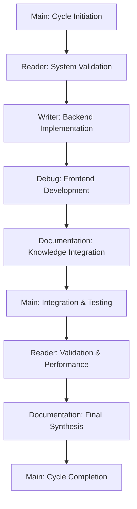

# UI Implementation Cycle Framework

**Created**: 2025-08-26  
**Thread Origin**: Documentation Thread - Multi-Thread Development Planning  
**Purpose**: Complete multi-thread development approach and implementation strategy for GBGreg project knowledge base UI cycle

## 🎯 **UI Implementation Cycle Overview**

### **Strategic Transition Framework**
```yaml
Cycle_Transition:
  Previous_Cycle: User Guide Development (Documentation-focused)
  Current_Cycle: UI Implementation (Development-focused)
  Next_Cycle: Production Deployment & User Adoption
  
  Development_Approach:
    - 5-thread orchestrated development model
    - Sequential workflow with parallel task execution
    - Iterative development with continuous testing
    - Knowledge preservation and agent enhancement integration
```

### **Implementation Success Criteria**
```yaml
Primary_Deliverables:
  Functional_Upload_System:
    - Web interface accepting zip file uploads with progress tracking
    - Project structure validation with priority folder processing
    - AI-powered project analysis and summarization
    - Database integration with searchable project storage
    
  Project_Review_Interface:
    - Responsive project browser with grid/list views
    - Advanced search with full-text and semantic capabilities  
    - Individual project pages with complete documentation access
    - Related project recommendations using AI similarity analysis
    
  System_Integration:
    - Seamless integration with existing GBGreg AI interface
    - Preserved 3.7-second response time performance standards
    - Zero-tolerance safety validation for all uploaded content
    - Mobile-responsive design supporting all device types
```

## 🧵 **Multi-Thread Development Strategy**

### **Thread Coordination Architecture**
```yaml
Thread_Responsibilities:
  Main_Thread:
    Role: "Orchestration & Quality Assurance"
    Responsibilities:
      - Coordinate development workflow between all threads
      - Maintain project timeline and milestone tracking
      - Integrate deliverables from specialized threads
      - Ensure consistency across all implementation components
      - Conduct final testing and validation procedures
    
  Reader_Thread:
    Role: "System Validation & Testing"
    Responsibilities:
      - Validate existing GBGreg functionality preservation
      - Test database schema and performance benchmarks
      - Verify API endpoint functionality and response times
      - Conduct integration testing between new and existing components
      - Validate mobile responsiveness and cross-device compatibility
    
  Writer_Thread:
    Role: "Backend Development & Infrastructure"
    Responsibilities:
      - Implement FastAPI backend services and database models
      - Deploy PostgreSQL database with optimized schema
      - Integrate DeepSeek AI service for project analysis
      - Implement file upload processing and validation systems
      - Configure Elasticsearch for search capabilities
    
  Debug_Thread:
    Role: "Frontend Development & UX Implementation"
    Responsibilities:
      - Develop Vue 3 + TypeScript frontend components
      - Implement responsive design with mobile-first approach
      - Create upload interface with drag-and-drop functionality
      - Build project browser with search and filtering capabilities
      - Integrate AI-powered project recommendation system
    
  Documentation_Thread:
    Role: "Knowledge Integration & Agent Enhancement"
    Responsibilities:
      - Document all implementation procedures and configurations
      - Update persistent SME agents with UI development expertise
      - Create deployment guides and operational procedures
      - Synthesize cross-cycle learning and pattern recognition
      - Prepare knowledge transfer for next production deployment cycle
```

### **Sequential Workflow Design**


## 📋 **Implementation Phase Planning**

### **Phase 1: Foundation & Backend (Weeks 1-2)**

#### **Week 1: Infrastructure Setup & Database Design**
```yaml
Main_Thread_Tasks:
  - Initialize UI implementation cycle coordination
  - Set up development environment and version control
  - Establish milestone tracking and progress monitoring
  - Coordinate initial thread assignments and communication

Reader_Thread_Tasks:
  - Validate current GBGreg system status and performance baselines
  - Analyze existing database architecture and integration requirements
  - Test current AI service endpoints and response times
  - Document system dependencies and integration points

Writer_Thread_Tasks:
  - Set up PostgreSQL database with optimized schema
  - Implement core database models and migration scripts
  - Configure database indexing for performance optimization
  - Set up backup procedures and data persistence strategies
  - Deploy database monitoring and health check systems
```

#### **Week 2: API Development & AI Integration**
```yaml
Writer_Thread_Tasks:
  - Implement FastAPI backend service architecture
  - Develop upload processing endpoints with validation
  - Integrate DeepSeek AI service for project analysis
  - Create search and discovery API endpoints
  - Implement authentication and authorization systems

Debug_Thread_Tasks:
  - Set up Vue 3 + TypeScript frontend development environment
  - Create basic application structure and routing
  - Implement authentication integration with backend
  - Develop core UI components and design system
  - Set up responsive design framework with mobile-first approach

Reader_Thread_Tasks:
  - Test API endpoint functionality and response times
  - Validate database performance under simulated load
  - Verify AI integration accuracy and processing times
  - Conduct security testing for upload and authentication systems
```

### **Phase 2: UI Development & Feature Implementation (Weeks 3-4)**

#### **Week 3: Upload System Implementation**
```yaml
Debug_Thread_Tasks:
  - Implement drag-and-drop file upload interface
  - Create upload progress tracking with real-time updates
  - Develop project structure validation visualization
  - Build upload status monitoring and error handling
  - Integrate AI analysis display and project summarization

Writer_Thread_Tasks:
  - Implement file processing pipeline with security validation
  - Deploy Elasticsearch for searchable content indexing
  - Create project analysis orchestration system
  - Implement pattern recognition and similarity analysis
  - Optimize upload processing performance and error handling

Reader_Thread_Tasks:
  - Test upload functionality with various file types and sizes
  - Validate project structure analysis accuracy
  - Verify AI summarization quality and processing times
  - Conduct security testing for file upload vulnerabilities
```

#### **Week 4: Project Browser & Search Implementation**
```yaml
Debug_Thread_Tasks:
  - Develop project browser with responsive grid/list views
  - Implement advanced search interface with filters
  - Create individual project detail pages
  - Build documentation viewer with syntax highlighting
  - Integrate related project recommendations display

Writer_Thread_Tasks:
  - Implement full-text and semantic search capabilities
  - Deploy project similarity matching algorithms
  - Create analytics service for usage tracking
  - Optimize database queries for search performance
  - Implement caching strategies for frequently accessed data

Reader_Thread_Tasks:
  - Test search functionality and result relevance
  - Validate project browser performance with large datasets
  - Verify mobile responsiveness across device types
  - Conduct usability testing and interface optimization
```

### **Phase 3: Integration & Deployment (Weeks 5-6)**

#### **Week 5: System Integration & Testing**
```yaml
Main_Thread_Tasks:
  - Coordinate full system integration testing
  - Validate seamless operation with existing GBGreg functionality
  - Conduct performance testing and optimization
  - Integrate all components into cohesive user experience

Reader_Thread_Tasks:
  - Comprehensive testing of all system components
  - Validate performance requirements and response times
  - Test concurrent user scenarios and load handling
  - Verify data integrity and backup procedures

Debug_Thread_Tasks:
  - Final UI polish and user experience optimization
  - Cross-browser compatibility testing and fixes
  - Mobile interface testing and responsive design validation
  - Accessibility compliance verification (WCAG 2.1 AA)

Documentation_Thread_Tasks:
  - Document all implementation procedures and configurations
  - Create deployment guides and operational procedures
  - Update system architecture documentation
  - Prepare user guides and training materials
```

#### **Week 6: Production Deployment & Knowledge Transfer**
```yaml
Writer_Thread_Tasks:
  - Deploy production backend services with monitoring
  - Configure production database with backup procedures
  - Set up performance monitoring and alerting systems
  - Implement production security and access controls

Main_Thread_Tasks:
  - Coordinate production deployment and rollout procedures
  - Validate all success criteria and performance metrics
  - Conduct final user acceptance testing
  - Prepare next cycle planning and requirements

Documentation_Thread_Tasks:
  - Complete knowledge synthesis and agent enhancement
  - Archive all implementation learnings and best practices
  - Update persistent SME agents with UI development expertise
  - Prepare comprehensive knowledge transfer for next cycle
```

## 🔄 **Agent Knowledge Enhancement Strategy**

### **Persistent SME Agent Updates**
```yaml
Debug_SME_Agent_Enhancement:
  New_Expertise_Domains:
    - UI/UX development with Vue 3 + TypeScript
    - Responsive design implementation and mobile optimization
    - File upload system development with security validation
    - API integration and frontend-backend communication
    - Performance optimization for web applications
    
  Enhanced_Troubleshooting:
    - Frontend debugging techniques and browser developer tools
    - UI component integration and state management issues
    - API endpoint testing and validation procedures
    - Cross-device compatibility testing and resolution
    - User experience optimization and accessibility compliance

Dashboard_Monitor_Agent_Enhancement:
  New_Monitoring_Capabilities:
    - Frontend application performance monitoring
    - User interaction analytics and behavior tracking
    - Upload system performance and success rate monitoring
    - Search functionality usage patterns and optimization
    - Mobile vs desktop usage analytics and optimization
    
  Enhanced_Alert_Management:
    - UI responsiveness and loading time alerts
    - Upload failure rate and error pattern monitoring
    - Search performance degradation detection
    - User experience quality threshold monitoring
    - System capacity and scaling requirement alerts
```

### **Pattern Library Expansion**
```yaml
New_Development_Patterns:
  Full_Stack_Web_Development:
    - Vue 3 + TypeScript + FastAPI architecture patterns
    - Responsive design implementation with mobile-first approach
    - File upload systems with progress tracking and validation
    - Search interface design with filtering and pagination
    - AI integration patterns for content analysis and recommendations
    
  Database_Integration:
    - PostgreSQL schema design for content management systems
    - Elasticsearch integration for full-text search capabilities
    - Database performance optimization for large content repositories
    - Data migration and backup procedures for production systems
    
  User_Experience_Design:
    - Progressive web application development patterns
    - Cross-device compatibility and responsive design techniques
    - User interaction flow optimization and conversion tracking
    - Accessibility compliance implementation (WCAG 2.1 AA standards)
    - Performance optimization for fast loading and interaction
```

## 📊 **Success Metrics and Validation Framework**

### **Technical Performance Metrics**
```yaml
Backend_Performance:
  API_Response_Times:
    - Upload processing: <30 seconds for 100MB projects
    - Search queries: <1 second for indexed content
    - Project detail loading: <2 seconds with full documentation
    - AI summarization: <10 seconds per project
    
  Database_Performance:
    - Search query execution: <500ms for complex filters
    - Project retrieval: <100ms for metadata queries
    - Concurrent user support: 50+ simultaneous users
    - Storage efficiency: <10% overhead for metadata indexing

Frontend_Performance:
  User_Interface_Metrics:
    - Initial page load: <3 seconds on 3G connections
    - Upload interface responsiveness: <100ms interaction feedback
    - Search result rendering: <500ms for 20 results
    - Mobile interface performance: 90+ Lighthouse score
    
  User_Experience_Quality:
    - Upload success rate: >95% for supported file formats
    - Search result relevance: >85% user satisfaction rating
    - Cross-device compatibility: 100% functionality on all major devices
    - Accessibility compliance: WCAG 2.1 AA standard conformance
```

### **Functional Success Criteria**
```yaml
Upload_System_Validation:
  Core_Functionality:
    - Successfully process zip files up to 500MB
    - Validate project structure with 90%+ accuracy
    - Generate AI summaries with <5% error rate
    - Index projects for search within processing workflow
    
  Error_Handling:
    - Graceful handling of corrupted or invalid files
    - Clear error messages and recovery procedures
    - Automatic retry mechanisms for transient failures
    - Complete rollback capabilities for failed uploads

Project_Browser_Validation:
  Search_Capabilities:
    - Full-text search across all project content
    - Technology-based filtering with accurate categorization
    - Semantic search with AI-powered content understanding
    - Related project discovery with similarity explanations
    
  User_Interface:
    - Intuitive navigation and project discovery workflow
    - Responsive design supporting desktop, tablet, and mobile
    - Fast loading and smooth interactions across all features
    - Accessible interface supporting screen readers and keyboard navigation
```

## 🚀 **Next Cycle Preparation Framework**

### **Production Deployment Cycle Readiness**
```yaml
Deployment_Preparation:
  Infrastructure_Requirements:
    - Production-ready backend services with monitoring
    - Scalable database configuration with backup procedures
    - CDN integration for fast asset delivery
    - Security hardening and access control implementation
    
  Operational_Procedures:
    - Deployment automation and rollback procedures
    - Performance monitoring and alerting systems
    - User onboarding and training material preparation
    - Support system integration and troubleshooting guides
    
  Success_Metrics:
    - User adoption targets and engagement measurement
    - System performance benchmarks and scaling thresholds
    - Content quality standards and validation procedures
    - Community building and knowledge sharing platform activation
```

### **Long-Term Hosted Service Evolution**
```yaml
Scalability_Planning:
  Multi_Tenant_Architecture:
    - Company-wide deployment with user management
    - Project privacy and access control systems
    - Resource allocation and usage monitoring
    - Performance optimization for concurrent users
    
  Content_Management:
    - Quality assurance for uploaded project content
    - Community moderation and content curation
    - Knowledge base growth and maintenance procedures
    - Training resource integration and optimization
    
  Continuous_Improvement:
    - User feedback integration and feature development
    - AI model improvement based on usage patterns
    - Pattern recognition enhancement through content analysis
    - Knowledge transfer optimization for organizational learning
```

---

**UI Implementation Cycle Framework Status**: ✅ **COMPREHENSIVE** - Complete multi-thread development strategy delivered with sequential workflow design, phase planning, agent enhancement strategy, and success validation framework ready for immediate implementation.

**Development Readiness**: 🚀 **ORCHESTRATED** - 5-thread coordination model prepared with clear responsibilities, milestone tracking, and knowledge integration procedures supporting seamless UI implementation cycle execution and next cycle preparation.