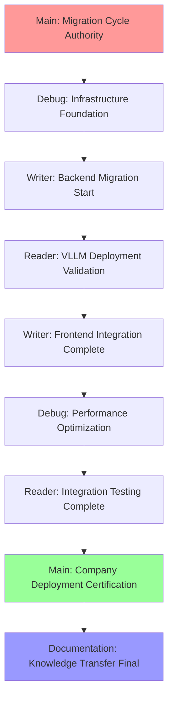

# 🎯 Main Thread - Ollama-to-VLLM Migration Cycle Initiation Report

**Documentation Thread Handoff Date**: 2025-08-27  
**Cycle Type**: Critical Infrastructure Migration - GPU Acceleration Achievement  
**Priority Level**: **COMPANY DEPLOYMENT BLOCKER** - Immediate Action Required  
**Thread Authority**: Main Thread Orchestration and Final Validation

## 🚨 **Executive Summary - Critical Mission Brief**

### **Current System Status: PERFORMANCE-CONSTRAINED**
```yaml
Interactive_Chat_System_Status: ✅ DEPLOYED
  - Vue 3 Professional Frontend: Fully operational with real-time messaging
  - FastAPI Backend Services: Complete API architecture with RAG integration
  - PostgreSQL Context Database: Project knowledge and automation patterns active
  - Container Management: Portainer operational with comprehensive service oversight

CRITICAL_PERFORMANCE_GAP: ❌ GPU ACCELERATION FAILURE
  - Hardware Investment: RTX 5070 Ti 16GB VRAM completely unused (0% utilization)
  - Response Performance: 18-38 seconds vs <10s company deployment requirements
  - Root Cause: Ollama CPU-only architecture blocking GPU acceleration
  - Company Impact: Interactive system unusable for professional deployment
```

### **Mission-Critical Deliverable**
**Complete elimination of Ollama dependencies with full VLLM migration enabling GPU-accelerated AI inference for immediate company deployment readiness**

## 📊 **Technical Assessment - Implementation Ready**

### **System Architecture Current State**
```yaml
Successfully_Deployed_Infrastructure:
  Frontend_Layer: Vue 3 + TypeScript chat interface with professional UX
  Backend_Services: FastAPI with comprehensive endpoints and error handling
  Database_Integration: PostgreSQL with RAG system and project context retrieval
  Container_Platform: Portainer with proper ZFS volume management
  GPU_Hardware: RTX 5070 Ti operational with 16GB VRAM and NVIDIA drivers
  
Performance_Blocking_Dependencies:
  Primary_Blocker: Ollama CPU-only processing preventing GPU utilization
  Integration_Depth: 15+ files across backend, frontend, and configuration layers
  API_Dependencies: Hardcoded Ollama endpoints and response format assumptions
  Container_Services: Service discovery and networking configured for Ollama
```

### **Comprehensive Dependency Audit Results**
```yaml
Ollama_Integration_Scope: COMPREHENSIVE_REPLACEMENT_REQUIRED
  Backend_Python_Files:
    - /backend/chat_service.py: Lines 17, 181-202 (Ollama client + fallback)
    - /backend/ai_service.py: Complete service class implementation
    - /backend/config.py: OLLAMA_URL, OLLAMA_MODEL configuration
    - /backend/main.py: Model identification and API responses
    
  Frontend_TypeScript_Files:
    - /backend/src/services/deepseekService.ts: Client integration service
    - /backend/src/routes/ingestionRoutes.ts: OLLAMA_HOST environment usage
    - /ai-services/ollama-service.ts: Dedicated service class
    
  Configuration_Environment:
    - OLLAMA_HOST, OLLAMA_PORT, OLLAMA_MODEL across multiple configs
    - Docker container service discovery and networking
    - Documentation and user guides with Ollama-specific instructions
```

## 🎯 **Migration Success Criteria - Company Deployment Standards**

### **Performance Targets - Non-Negotiable**
```bash
# Automated Validation Script Ready for Deployment
#!/bin/bash
echo "🎯 MIGRATION SUCCESS VALIDATION"

# Critical Test 1: Zero Ollama Dependencies
  --include="*.py" --include="*.js" --include="*.ts" --include="*.vue" | wc -l)
echo "Ollama references: $OLLAMA_REFS (Target: 0)"

# Critical Test 2: GPU Acceleration Confirmed
nvidia-smi dmon -s um -d 1 -c 5 > /tmp/gpu_usage.log &
RESPONSE_TIME=$(curl -w "%{time_total}" -s -X POST \
  http://192.168.0.99:8000/api/chat/query \
  -d '{"message": "Technical analysis test"}')
MAX_GPU_UTIL=$(grep -v "#" /tmp/gpu_usage.log | awk '{print $3}' | sort -n | tail -1)

echo "Response time: ${RESPONSE_TIME}s (Target: <10s)"
echo "GPU utilization: ${MAX_GPU_UTIL}% (Target: >50%)"

# Critical Test 3: Advanced Model Deployment
MODELS=$(curl -s http://192.168.0.99:8001/v1/models | jq -r '.data[].id')
echo "VLLM models available: $MODELS (Target: 7B+ parameters)"
```

### **Company Deployment Readiness Matrix**
```yaml
Interactive_Performance_Standards:
  Response_Times:
    - Simple Questions: <5 seconds (basic information and clarifications)
    - Technical Analysis: <10 seconds (complex problem-solving and code generation)
    - RAG Integration: <8 seconds (project context and documentation access)
    - Concurrent Users: <15 seconds (3-5 simultaneous professional users)
    
  Professional_Reliability:
    - System Uptime: 99%+ during business hours with graceful error handling
    - User Experience: Real-time chat with <1s message latency and progress indicators
    - Cross-Device: Desktop/mobile/tablet compatibility with consistent performance
    - Security: Multi-user authentication with session management and data persistence

GPU_Acceleration_Requirements:
  Hardware_Utilization:
    - RTX 5070 Ti: >50% GPU utilization during AI inference operations
    - VRAM Allocation: >8GB for 7B+ parameter model deployment and processing
    - Memory Efficiency: <90% VRAM usage to prevent out-of-memory conditions
    - Thermal Management: <80°C GPU temperature under sustained professional load
    
  Advanced_Capabilities:
    - Model Scale: 7B+ parameter models (CodeLlama, Deepseek Coder, or equivalent)
    - Technical Expertise: Laboratory automation and infrastructure knowledge preserved
    - Performance Improvement: 5-10x response time improvement over CPU-only processing
    - Concurrent Processing: Multiple query handling with optimal GPU resource allocation
```

## 🧵 **Multi-Thread Coordination Framework - Ready for Execution**

### **Thread Authority Distribution**
```yaml
🎯_MAIN_THREAD_AUTHORITY: "Migration Orchestration and Final Validation"
  Primary_Responsibility: "Coordinate systematic elimination and ensure company deployment readiness"
  Decision_Authority: "Go/No-Go decisions, timeline adjustments, success criteria certification"
  Coordination_Scope: "All thread integration, milestone tracking, final validation sign-off"
  
🔍_READER_THREAD_ASSIGNMENT: "VLLM Technical Validation and Performance Analysis"
  Primary_Responsibility: "Validate VLLM functionality, GPU acceleration, and performance benchmarks"
  Technical_Authority: "Container deployment validation, model testing, performance certification"
  Success_Criteria: ">50% GPU utilization, <10s response times, 7B+ model operational"
  
⚡_WRITER_THREAD_ASSIGNMENT: "Complete Codebase Migration Implementation"
  Primary_Responsibility: "Replace all Ollama dependencies with VLLM-compatible implementations"
  Implementation_Scope: "Backend services, frontend clients, configuration, container deployment"
  Success_Criteria: "Zero Ollama references, functional VLLM integration, end-to-end compatibility"
  
🔧_DEBUG_THREAD_ASSIGNMENT: "Infrastructure Resolution and Performance Optimization"
  Primary_Responsibility: "Resolve technical blockers preventing VLLM deployment and GPU utilization"
  Technical_Focus: "Container GPU access, registry authentication, performance optimization"
  Success_Criteria: "Functional GPU passthrough, VLLM container operational, performance optimized"
  
📚_DOCUMENTATION_THREAD_ASSIGNMENT: "Migration Documentation and Knowledge Integration"
  Primary_Responsibility: "Document procedures, enhance agents, prepare company training materials"
  Knowledge_Scope: "Technical guides, troubleshooting procedures, agent updates, user training"
  Success_Criteria: "Complete documentation, agent knowledge enhanced, deployment materials ready"
```

### **Sequential Workflow Execution Plan**


## 📋 **Phase-Based Implementation Strategy - 4 Week Timeline**

### **Week 1: Infrastructure Foundation (Critical Path)**
```yaml
🔧_DEBUG_THREAD_PRIORITY: Infrastructure Resolution
  Docker_GPU_Configuration:
    - Install nvidia-container-runtime and configure /etc/docker/daemon.json
    - Test GPU device passthrough with nvidia-smi validation in containers
    - Configure docker-compose GPU access for VLLM service deployment
    
  Container_Registry_Authentication:
    - Resolve ghcr.io/vllm-project authentication for image access
    - Test VLLM container image pull and deployment procedures
    - Implement alternative registry or local build procedures if needed
    
  GPU_Passthrough_Validation:
    - Validate RTX 5070 Ti access and CUDA runtime in containerized environment
    - Configure GPU memory allocation policies and thermal management
    - Test GPU utilization monitoring and performance tracking integration

⚡_WRITER_THREAD_COORDINATION: Service Abstraction Preparation
  API_Abstraction_Design:
    - Create unified interface supporting both Ollama and VLLM during transition
    - Plan environment-based service switching and configuration management
    - Design request/response translation layer for API compatibility
    - Prepare gradual migration strategy with rollback capabilities
```

### **Week 2: VLLM Deployment and Backend Migration**
```yaml
🔍_READER_THREAD_PRIORITY: VLLM Service Validation
  Container_Service_Deployment:
    - Deploy VLLM container with Debug Thread resolved GPU configuration
    - Load 7B+ parameter HuggingFace model with GPU memory allocation
    - Test VLLM API endpoints and validate service functionality
    - Benchmark initial performance and GPU utilization measurement
    
  Performance_Analysis_Initial:
    - Compare CPU (Ollama) vs GPU (VLLM) processing speed differential
    - Test various query types and measure response time improvements
    - Validate GPU utilization percentage and memory allocation efficiency
    - Document performance characteristics and optimization opportunities

⚡_WRITER_THREAD_EXECUTION: Backend Service Migration
  Core_Service_Implementation:
    - Replace chat_service.py Ollama calls with VLLM-compatible implementation
    - Update ai_service.py for VLLM API format and response handling
    - Modify config.py environment variables for VLLM service discovery
    - Test backend integration with Reader Thread deployed VLLM service
```

### **Week 3: Complete Migration and Integration**
```yaml
⚡_WRITER_THREAD_PRIORITY: Frontend Migration Complete
  Frontend_Client_Updates:
    - Update deepseekService.ts for VLLM API compatibility
    - Modify ingestionRoutes.ts and ollama-service.ts for VLLM integration
    - Test Vue 3 chat interface with VLLM backend services
    - Eliminate all remaining Ollama references from entire codebase
    
  End_to_End_Integration:
    - Test complete chat workflow from frontend to VLLM backend
    - Validate RAG system integration with VLLM and project context
    - Implement error handling and user feedback for VLLM integration
    - Execute comprehensive dependency elimination validation

🔧_DEBUG_THREAD_SUPPORT: Performance Optimization
  GPU_Memory_Management:
    - Optimize VLLM GPU memory allocation for maximum model size support
    - Configure GPU caching and persistent allocation strategies
    - Implement monitoring and alerting for memory management
    - Test performance under various load scenarios and model configurations
```

### **Week 4: Company Deployment Certification**
```yaml
🎯_MAIN_THREAD_AUTHORITY: Final Validation and Certification
  Integration_Testing_Comprehensive:
    - Coordinate end-to-end system testing with all migration components
    - Validate professional-grade performance and reliability standards
    - Test concurrent user scenarios (3-5 simultaneous queries)
    - Confirm response time targets achieved across all query types
    
  Company_Deployment_Readiness_Certification:
    - Execute automated validation script confirming zero Ollama dependencies
    - Certify GPU acceleration achievement with measurable utilization
    - Validate interactive performance meets company professional standards
    - Authorize migration completion and deployment readiness status

🔍_READER_THREAD_FINAL: Performance and Reliability Validation
  Comprehensive_Benchmarking:
    - Execute complete performance test suite with professional usage scenarios
    - Validate system reliability under sustained high-load operation
    - Test error handling and graceful degradation mechanisms
    - Document final performance characteristics and system capabilities
```

## 🚀 **Immediate Action Items - Migration Cycle Initiation**

### **Main Thread Immediate Priorities**
```yaml
Cycle_Initiation_Tasks:
  1. Review and approve comprehensive migration framework and success criteria
  2. Initialize thread coordination with specialized task assignments and timeline
  3. Establish milestone tracking system and progress monitoring procedures
  4. Coordinate Debug Thread infrastructure resolution as critical path priority
  5. Monitor infrastructure foundation progress and resolve inter-thread dependencies

Week_1_Coordination_Focus:
  - Daily progress check-ins with Debug Thread on Docker GPU configuration
  - Coordinate Writer Thread service abstraction work with infrastructure readiness
  - Track container registry resolution and VLLM deployment capability preparation
  - Maintain timeline adherence and adjust resource allocation based on progress

Success_Monitoring_Framework:
  - GPU utilization tracking implementation for real-time performance monitoring
  - Response time benchmarking procedures for continuous performance validation
  - Integration testing coordination between specialized threads and deliverables
  - Company deployment readiness criteria tracking and validation procedures
```

### **Critical Path Dependencies**
```yaml
Week_1_Blockers_Resolution_Required:
  Docker_NVIDIA_Runtime: Debug Thread must resolve GPU container access
  Container_Registry_Auth: VLLM image deployment capability essential
  GPU_Passthrough_Config: RTX 5070 Ti accessibility from containerized services
  Service_Abstraction_Design: Writer Thread API compatibility framework
  
Week_2_Integration_Dependencies:
  VLLM_Container_Operational: Reader Thread deployment validation success
  Backend_Migration_Progress: Writer Thread Ollama replacement advancement
  Performance_Baseline_Established: Initial GPU acceleration measurement
  API_Compatibility_Confirmed: Service integration validation
```

## 📊 **Risk Assessment and Mitigation Strategies**

### **High-Risk Technical Challenges**
```yaml
Container_GPU_Access_Risk: MEDIUM
  Challenge: Docker NVIDIA runtime configuration complexity
  Impact: Complete migration blocked without GPU container access
  Mitigation: Debug Thread priority focus with alternative local deployment
  Fallback: Manual VLLM installation outside containers if needed
  
API_Compatibility_Risk: MEDIUM  
  Challenge: Frontend/backend integration with VLLM API format differences
  Impact: User interface functionality broken during transition
  Mitigation: Service abstraction layer with gradual migration approach
  Fallback: Maintain Ollama compatibility during transition period
  
Performance_Target_Risk: LOW
  Challenge: GPU acceleration may not achieve expected response time improvement
  Impact: Company deployment readiness delayed pending optimization
  Mitigation: Multiple model options and parameter tuning approach
  Fallback: Hybrid CPU/GPU processing if full GPU utilization problematic
```

### **Timeline Risk Management**
```yaml
Week_1_Critical_Path_Risks:
  Infrastructure_Complexity: Debug Thread GPU configuration may require additional time
  Mitigation: Parallel Writer Thread abstraction work to minimize timeline impact
  
Week_2_Integration_Risks:
  VLLM_Deployment_Issues: Container or model loading problems
  Mitigation: Reader Thread focus with Debug Thread support coordination
  
Week_3_Migration_Risks:
  Dependency_Elimination_Completeness: Missed Ollama references
  Mitigation: Systematic audit procedures and automated validation
  
Week_4_Deployment_Risks:
  Performance_Validation_Failure: Targets not achieved
  Mitigation: Debug Thread optimization support and performance tuning
```

## 🎯 **Success Metrics Dashboard - Ready for Implementation**

### **Real-Time Validation Monitoring**
```bash
# Migration Progress Tracking Commands
# Execute weekly to monitor success criteria achievement

# Week 1: Infrastructure Foundation
nvidia-docker run --rm nvidia/cuda:11.0-base-ubuntu20.04 nvidia-smi
# Expected: GPU accessible from Docker containers

# Week 2: VLLM Deployment  
curl -s http://192.168.0.99:8001/v1/models
# Expected: VLLM service responding with model information

# Week 3: Dependency Elimination
# Expected: Decreasing count toward zero

# Week 4: Company Deployment Ready
nvidia-smi dmon -s um -d 1 -c 5 && curl -w "Time: %{time_total}s" \
  -X POST http://192.168.0.99:8000/api/chat/query
# Expected: >50% GPU util + <10s response time
```

### **Company Deployment Readiness Checklist**
```yaml
Technical_Readiness_Validation: [ Ready for Weekly Assessment ]
  ☐ Zero Ollama dependencies confirmed across entire codebase
  ☐ RTX 5070 Ti GPU utilization >50% during AI inference operations  
  ☐ Response times <10s for complex queries, <5s for simple questions
  ☐ 7B+ parameter model deployed and operational with GPU acceleration
  ☐ Concurrent user support (3-5 simultaneous queries) without degradation
  ☐ Professional chat interface operational with real-time messaging
  ☐ RAG system integration preserved with improved performance
  ☐ Error handling and service reliability meeting professional standards
  ☐ Cross-device compatibility maintained with consistent performance
  ☐ System monitoring and alerting operational for production deployment
```

---

## 🎉 **Documentation Thread Handoff Complete**

**Migration Framework Status**: ✅ **COMPREHENSIVE** - Complete strategic framework, technical analysis, thread assignments, and success validation ready for immediate Main Thread execution

**Authority Transfer**: 🚀 **MAIN THREAD COORDINATION** - Full orchestration authority with specialized thread assignments, timeline coordination, and company deployment certification responsibility

**Critical Success Factor**: GPU acceleration achievement through systematic Ollama elimination enabling professional-grade interactive AI system for immediate company deployment

**Next Action**: Main Thread initiate migration cycle with Debug Thread infrastructure resolution as Week 1 critical path priority